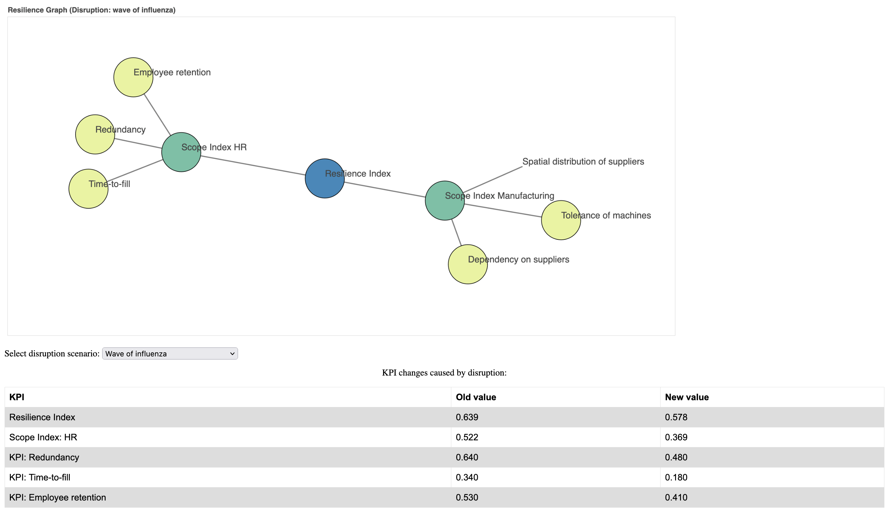

# GRACE

## 1. Description

Resilience has become crucial for manufacturing organizations in the face of various crises and uncertainties. However, current risk management practices often lack systematic resilience assessment due to the fuzzy nature of resilience. We introduce GRACE, a model for graph-based organizational resilience assessment in the manufacturing sector. GRACE utilizes centrality measures to model key performance indicators (KPIs) of business units for highlighting critical areas that significantly influence organizational functionality. By employing resilience metrics and a graph-based representation, simulated disruption scenarios can be induced for identifying vulnerabilities in business units that may lead to lower resilience. The effectiveness of GRACE was demonstrated within a simulation service for risk and crisis management in manufacturing and evaluated in a case study. Results showcased GRACE's performance in resilience assessment and its potential to enhance organizational preparedness with respect to response strategies.

## 2. Running the demonstrator

- There are no requirements besides having a recent browser installed (e.g., Chrome or Firefox).
- To run the demonstrator, simply open any of the HTML files included in this repository (e.g., KMUpre.html) in your browser.
To switch between disruption scenarios, select the desired item from the dropdown menu right under the graph visualization.
To switch been company sizes, select the corresponding item from the dropdown menu at the top of the page.

## 3. Experiment with own settings and disruptions

- To run the backend only, Java and Gradle are required to be installed on your system. Navigate to the "backend" folder and run the following command in your shell terminal:
    '''
    "./gradlew run" in your shell terminal.
    '''
- To experiment with the backend and implement your own company settings as well as disruption scenarios, go to the "backend" -> "app" -> "config" folder. Here, you'll find two subfolders:
    - The "system" folder contains system configurations. These are JSON files defining the possible disruptions as well as the relevant scopes, KPIs and their weights. You can take a look at any of the files and adapt them to your wishes or implement your own. The disruption scenario evaluation always uses the file called "system_config.json", so make sure to rename the current file with this name and rename the config file you want to be simulated accordingly.
    - The "user" folder contains the disruption configurations. All KPIs (that must always match the KPIs defined in the system configuration, see above) are assigned their current (pre-disruption) value, and a specific disruption is selected from the list of possible disruptions defined in the system configuration. Here as well, the disruption scenario evaluation uses only the "user_config.json" file. Thus, make sure to rename your file(s) accordingly.