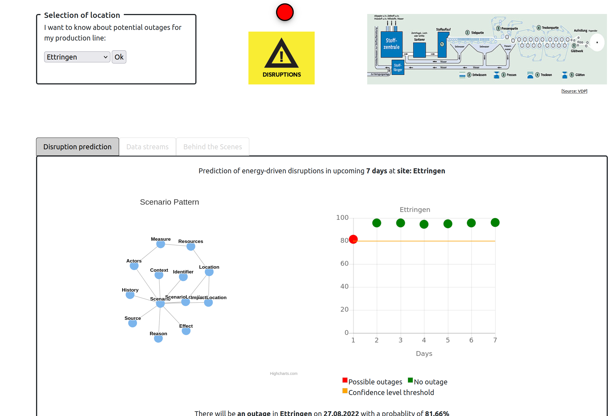

# Outage Predictor

## 1. Description


<p> 

The Outage Predictor represents a system for predicting regional power outages for energy-intensive process industries, such as glass and paper production. Unplanned power outages or fluctuations below 49.8 and above 50.2 Hertz can lead to uncontrolled shutdowns of frequency-sensitive machinery, with serious consequences for production equipment. This results in unplanned downtime, destruction of machine parts, additional costs for staffing and production losses. The Outage Predictor enables prediction of regional power outages for locations in the German paper industry (initially in Bavaria) and a time horizon of a maximum of 7 days using AI-based scenario planning.
    
</p>


## 2. How it works

<p> 

After selecting the location of the paper manufacturer, disruption forecasts are generated for the next few days. As shown below, green nodes mean that it is predicted that there will be no power outage, red nodes that a power outage will occur. The orange line shows a threshold for the forecast with high confidence values. 

Behind, there is a predictive model generated using machine learning (XGBoost) and historical data of power outages (2012-2020) and weather data (2012-2020); the model is applied to current streams of weather data to make the prediction. 


Data is linked and transformed into a knowledge graph creating such a pattern of a potential crisis scenario. The pattern provides additional explanations to the forecast ---> e.g. influencing factors (weather) that may have led to the power outage as well as possible recommended actions (



<p> 

## 3. Installation 

- Prerequisites:

	```Python 3.9 or higher.``` You can follow [this guide](https://phoenixnap.com/kb/upgrade-python) on how to install it on Windows/macOS/Linux.

- Clone/Download the repository:

	- Open a terminal (Linux) or cmd (Windows) and run the following command to clone the repository:
	```
	git clone https://github.com/InformationServiceSystems/pairs-scms.git
	```

- Intsall the dependencies 

	- In the terminal, run the following command to go to demo directory. 
	```
	cd pairs-scms/POC/OutagePredictor/Demo
	```
	- Then run this command to install the dependencies
	```
	pip install -r requirements.txt
	```

- Start the backend server.

	- Go back to the directory where you downloaded the repo and run this command to go to backend directory:
	```
	cd pairs-scms/POC/OutagePredictor/Demo/backend/forecast/
	```
	- Run server
	```
	python manage.py runserver
	```
	- Leave this terminal running. 

- Start the frontend server:
	- Open a new terminal and Go to demo directory again:
	```
	cd pairs-scms/POC/OutagePredictor/Demo/
	```
	- Run server
	```
	python -m http.server
	```

- Finally, go the internet browser (Chrome) and type in the url <http://localhost:8000/>


